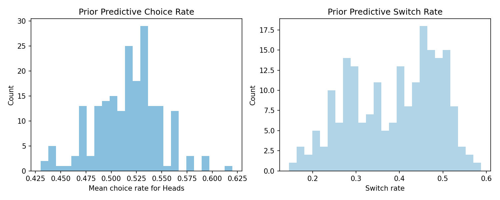
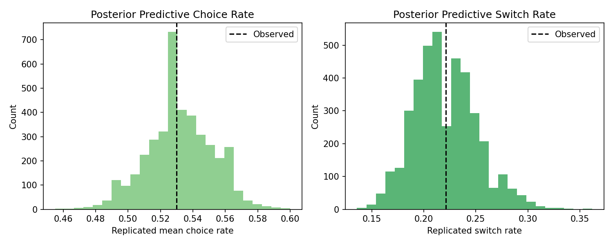
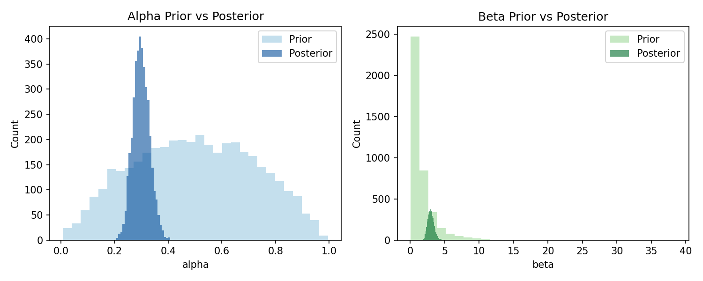
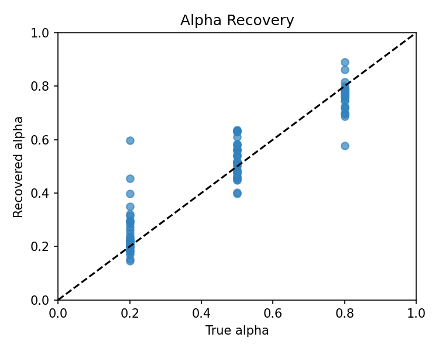
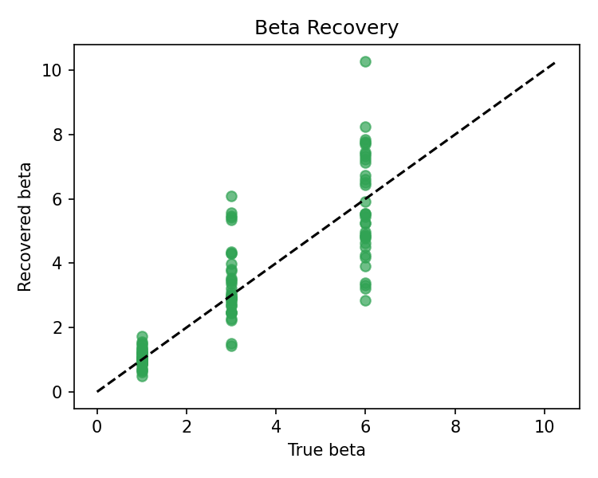
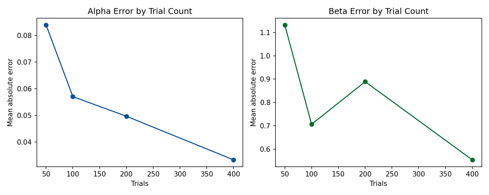

# Single-Agent Belief Learning Model for Matching Pennies

## 1. Introduction

The aim of this assignment is to build and validate a cognitive model of matching pennies behaviour in Stan. The model selected here is a single agent belief learning model with softmax choice. This model assumes that the agent forms and updates a belief about the probability that the opponent will choose Heads on the next trial, and then converts that belief into a stochastic choice policy.

This model is attractive for the present assignment because it is both psychologically interpretable and technically manageable. The learning-rate parameter captures how strongly the agent updates beliefs after observing the opponent, while the inverse-temperature parameter captures how consistently those beliefs are translated into overt choices. The model therefore provides a compact account of both learning and decision noise.

The present report focuses on the required single agent version only. Optional extensions such as a multilevel model or analysis of an empirical dataset were not pursued, because the main objective was to establish a clear and well validated baseline model.

## 2. Model Specification

The model contains two free parameters:

- `alpha in (0, 1)`, the learning rate
- `beta > 0`, the inverse temperature

The latent belief `p_t` represents the subjective probability that the opponent will choose Heads. Belief updating follows a delta rule:

```text
p_t = p_(t-1) + alpha * (opp_(t-1) - p_(t-1))
```

with initial belief fixed at `p_0 = 0.5`. This initial value reflects an uninformative starting assumption that the opponent is equally likely to choose Heads or Tails.

Given the current belief, the agent computes values for the two available actions in matching pennies:

```text
v_H = 2p_t - 1
v_T = 1 - 2p_t
```

These values are transformed into a choice probability through a softmax rule:

```text
P(y_t = Heads) = inv_logit(beta * (v_H - v_T))
```

Higher values of `alpha` imply faster updating, whereas higher values of `beta` imply more deterministic choice. Together, these parameters define how quickly the agent learns from the opponent and how strongly that learning influences behaviour.

The Stan implementation of the model is provided in [belief_model.stan](../stan/belief_model.stan), and a fully commented version is provided in [belief_model_commented.stan](../stan/belief_model_commented.stan).

## 3. Commented Stan Model

The Stan model consists of four conceptually distinct parts.

First, the `data` block declares the number of trials, the participant's binary choices, and the opponent's binary choices. Second, the `parameters` block defines the two free parameters, `alpha` and `beta`. Third, the `model` block specifies the priors and the likelihood, initializes the belief state, computes the action values on each trial, applies the softmax rule, and updates the belief after observing the opponent's move. Finally, the `generated quantities` block generates posterior predictive choices and calculates the summed log-likelihood, both of which are useful for model checking.

This structure is appropriate for a coursework submission because it makes the cognitive interpretation of each line transparent. In particular, the belief update on each trial can be read directly from the Stan code, which helps link the mathematical assumptions of the model to the observed behavioural data.

## 4. Priors

The priors used in the model are:

- `alpha ~ beta(2, 2)`
- `beta ~ lognormal(0, 1)`

These priors are weakly informative. The beta prior on `alpha` places more mass on intermediate values than on the extremes, which is reasonable if one expects neither completely static nor completely one-shot learning. The lognormal prior on `beta` ensures positivity and regularizes implausibly large values of response determinism.

The role of priors in this assignment is not merely technical. Priors influence both the plausibility of the model before data are observed and the stability of posterior inference after data are observed. For that reason, prior predictive checks and prior posterior comparisons are an essential part of model evaluation.

## 5. Model Quality Checks

Model quality was assessed using prior predictive checks, posterior predictive checks, and prior posterior update checks. These checks go beyond reporting a fitted parameter estimate and instead evaluate whether the model generates sensible behaviour, captures the observed data, and learns meaningfully from those data.

### 5.1 Prior Predictive Checks

In the prior predictive check, parameter values were sampled from the priors and used to generate behaviour for the observed opponent sequence. Summary statistics such as mean choice rate and switch rate were then examined.

Figure 1 shows the resulting prior predictive distributions.



The prior predictive choice-rate distribution is centered close to `0.5`, which is appropriate for matching pennies because the task is symmetric and the model should not imply a strong directional bias in advance. The prior predictive switch-rate distribution is fairly broad, but it remains concentrated in a plausible middle region rather than collapsing onto extremely repetitive or extremely volatile behaviour. This suggests that the chosen priors are reasonable and do not generate pathological behaviour before fitting.

### 5.2 Posterior Predictive Checks

Posterior predictive checks evaluate whether the fitted model can reproduce important features of the observed data. After fitting the model, replicated datasets were generated from the posterior, and the observed mean choice rate and switch rate were compared with the replicated distributions.

Figure 2 presents the posterior predictive checks.



In both panels, the observed statistic falls within the main body of the posterior predictive distribution. This indicates that the model captures these coarse behavioural summaries adequately. Although this does not prove that the model is correct in every respect, it does suggest that the model is not grossly inconsistent with the data it was fitted to.

### 5.3 Prior Posterior Update Checks

Prior-posterior comparisons were used to examine whether the data meaningfully updated beliefs about the model parameters. If the posterior remained nearly identical to the prior, that would indicate that the data were weakly informative or that the model was poorly identified.

Figure 3 compares the prior and posterior distributions of the two parameters.



For `alpha`, the posterior is substantially narrower than the prior and is concentrated around a moderate learning-rate region. For `beta`, the posterior is also more concentrated than the prior, although it remains more skewed and diffuse than the posterior for `alpha`. Overall, the figure suggests that the data do inform both parameters, but that `beta` is estimated with less precision.

## 6. Parameter Recovery

Parameter recovery is an important validation exercise because a model may fit data well without being able to recover the true generating parameters. In cognitive modelling, recovery therefore addresses the question of identifiability: if the model generates data with known parameter values, can the fitting procedure recover those values?

In the present analysis, recovery was carried out by simulating datasets over a grid of generating values for `alpha` and `beta`, and by repeating this process across several trial counts: `T = 50, 100, 200, 400`. Each simulated dataset was then fit with the same Stan model, and recovered posterior means were compared with the true values. Recovery quality was evaluated visually with scatter plots and numerically using mean absolute error. The relevant script is [parameter_recovery.py](../scripts/parameter_recovery.py), and the numerical summaries are stored in [recovery_summary.csv](../data/recovery/recovery_summary.csv).

### 6.1 Recovery of `alpha`

Figure 4 shows the alpha-recovery results.



The recovered values show clear separation across the generating values `0.2`, `0.5`, and `0.8`, and most points lie reasonably near the identity line. This indicates that the model is able to distinguish low, medium, and high learning rates with acceptable accuracy.

The mean absolute error for `alpha` decreased from `0.084` at `T = 50` to `0.057` at `T = 100`, `0.050` at `T = 200`, and `0.033` at `T = 400`. This pattern suggests that learning rate recovery improves as more trials are observed, and that the estimate of `alpha` becomes increasingly stable with longer sequences.

### 6.2 Recovery of `beta`

Figure 5 shows the beta-recovery results.



The recovered values do increase as the true generating values increase, which is encouraging, but the spread is noticeably larger than for `alpha`, especially at higher values of `beta`. This implies that the model captures the general ordering of response determinism more reliably than the exact magnitude of the inverse temperature parameter.

The mean absolute error for `beta` was `1.132` at `T = 50`, `0.707` at `T = 100`, `0.889` at `T = 200`, and `0.554` at `T = 400`. The overall trend still favours longer tasks, but the pattern is noisier than for `alpha`. In particular, the slight worsening at `T = 200` relative to `T = 100` indicates that beta recovery is more variable and sensitive to sampling noise.

### 6.3 Effect of Trial Count

Figure 6 summarizes how recovery error changes as trial count increases.



For `alpha`, the reduction in error is close to monotonic. For `beta`, the decline is less regular, but the best recovery is still obtained at the longest trial count tested.

Taken together, these results suggest that the model recovers `alpha` reasonably well and `beta` only moderately well. A cautious conclusion is that `T = 50` is too short for stable recovery, `T = 100` may be usable but remains noisy, and `T >= 200` is a more defensible lower bound for reliable parameter estimation in this model. Among the tested conditions, `T = 400` produces the strongest recovery overall.

## 7. Discussion

The present results provide a broadly positive evaluation of the single agent belief learning model. The prior predictive checks indicate that the priors generate plausible behaviour, the posterior predictive checks indicate that the fitted model can reproduce key summary statistics of the observed data, and the prior posterior comparisons indicate that the data are informative for both parameters.

The strongest aspect of the model is recovery of the learning rate parameter. The `alpha` results show that the model is able to distinguish different levels of belief updating with reasonable accuracy, especially once the number of trials is sufficiently large. The weaker aspect of the model is recovery of `beta`. Although the model does capture broad differences in choice consistency, estimation of `beta` is noticeably noisier. This is not surprising, because in binary choice tasks the evidence for response determinism is often weaker than the evidence for a structured learning signal.

The priors appear to play an appropriate regularizing role. They help constrain the inference problem and prevent extreme estimates, while still allowing the posterior to move away from the prior in response to the data. This is particularly important for `beta`, where the likelihood is comparatively noisy.

At the same time, the results should be interpreted with some caution. Stan produced nonfatal warnings of the form `bernoulli_lpmf: Probability parameter is nan`, together with a modest number of divergent transitions in some recovery fits. These warnings did not prevent the figures or summary tables from being generated, but they do indicate that the model could be improved further, for example through reparameterization, stronger numerical safeguards, or longer sampling runs. In addition, the recovery analysis used a relatively small number of repetitions per condition in order to keep computation manageable. As a result, some apparent irregularities, especially in beta recovery, may partly reflect Monte Carlo variability rather than a systematic property of the model.

## 8. Optional Extension: Free Initial Belief

One possible extension would be to estimate a free initial belief parameter `p0 in (0, 1)` rather than fixing `p0 = 0.5`. This is feasible in principle, but it is not obviously beneficial for the current assignment.

The main concern is identifiability. The parameter `p0` is informed primarily by the earliest trials, and its effect can trade off with `alpha`, since both influence the early trajectory of belief updating. In short tasks, this trade-off may make recovery more difficult rather than more informative. For that reason, fixing `p0 = 0.5` is a sensible modelling decision for the single-agent coursework version.

## 9. Conclusion

This coursework implemented and evaluated a single agent belief learning model with softmax choice for matching pennies behaviour in Stan. The model provides an interpretable account of how an agent updates beliefs about an opponent and converts those beliefs into stochastic choices. The results show that the model passes basic prior predictive, posterior predictive, and prior posterior checks, and that parameter recovery is acceptable overall.

The main substantive conclusion is that the model recovers `alpha` more reliably than `beta`, and that recovery improves with increasing trial count. On the basis of the present analyses, at least around `200` trials appear desirable if the goal is reasonably stable parameter estimation, with `400` trials yielding the strongest recovery among the tested conditions. Overall, the model serves as a credible and interpretable baseline cognitive model for the assignment, while also making clear where further refinement would be valuable.
